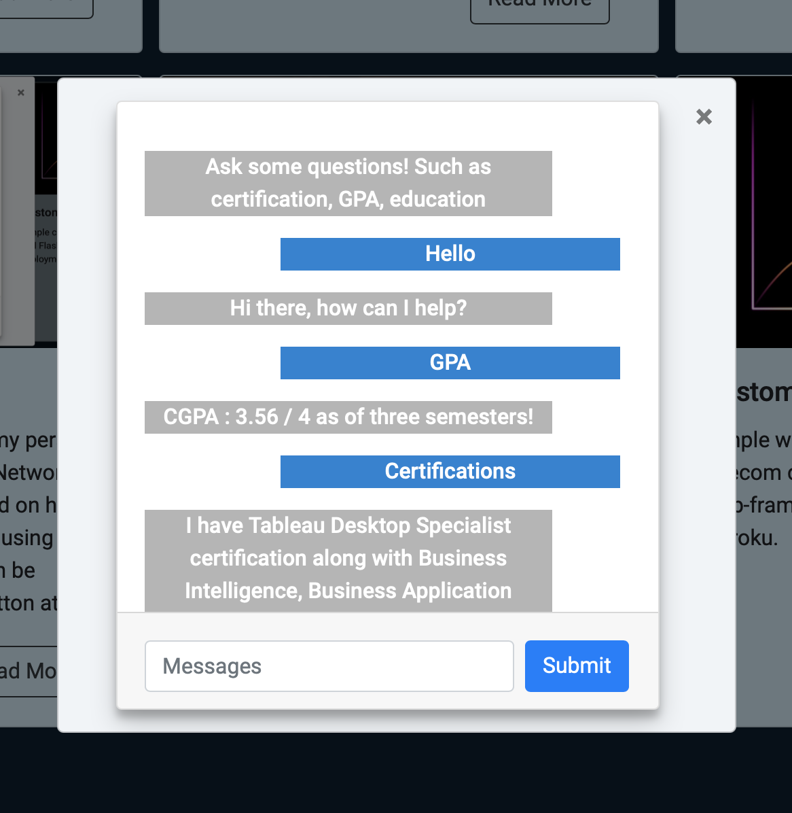

# DEEP LEARNING CHAT BOT

## INTRODUCTION

A chatbot is a programmed chat interface a website visitor can interact with. Having a chatbot on website can help to take customer experience to the next level. They can act as a guide on the website to help visitors get answers to their queries instantly or help them get to certain page of the website. 

## AIM

The aim of the project was to create a 'Simple ChatBot' and integrate into my portfolio website. A simple chatbot means that it responds to pre-written keywords or commands programmed by a developer. Thus, the chatbot is programmed to answer to queries such as 'My education details', 'My GPA details', 'My Certification Details' etc.

## DATA

Since the chatbot responds using pre-written keywords, I have manually created a dataset of common questions and responses that could be helpful for users visiting my portfolio website. For example: Certification details, GPA, Education, Age, Work Ex etc. The data file is called [intents.json](data/intents.json) and can be found in the data folder.

## MODELING

1. Using NLTK library for natural-language processing performed stemming i.e mapping words to their original stem.

2. Created Bag of Words (BoW) to represent all the unique words appearing in data.

3. Created 5 layer fully-connected Deep Neural Network (DNN) using Tflearn (Tensorflow Learn) library's DNN function.

4. Made sure the predictions from the model had at least 70% confidence level or else the reply will be 'Please try another question'.

5. The model is only trained when the system detects the intents.json file is changed.

## CLOUD DEPLOYMENT

Using Flask web-framework deployed the model on Heroku Cloud. The app processes 'get' requests and returns the predicted reply by the model.

## PORTFOLIO INTEGRATION

1. The front end for the chatbot is designed using HTML, BOOTSTRAP and CSS and JQuery so that the page is updated without need to refresh.

2. In addition, the website uses JQuery to send a 'get' request to the model deployed on Heroku Cloud to retrieve the reply for the users input.

3. Another JQuery script in the website pings the model in the background as soon as the user visits the site in order to wake the model from idle state.

The app can be accessed by visiting my portfolio website onkarane.com. 

